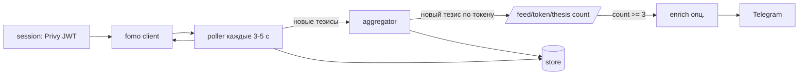

# fomo thesis signal bot — техническое задание

Сервис на Go, который следит за тезисами (thesis) трейдеров на fomo.family, агрегирует их по токенам Solana, применяет фильтры и отправляет адрес контракта токена в Telegram.

> Статус: исследование API завершено частично (см. раздел «Открытые вопросы»). Всё ниже получено наблюдением за трафиком сайта из браузера под своим аккаунтом (сентябрь 2026). Официального публичного API у fomo нет, поэтому схема может поменяться в любой момент.

---

## 1. Цель

1. Каждые несколько секунд получать свежие тезисы с fomo.
2. Для каждого токена считать тезисы за скользящее окно времени.
3. Когда токен проходит фильтры, отправить сообщение в Telegram: тикер, адрес контракта (mint), сколько тезисов, кто автор, размер позиций, market cap.
4. Не слать один и тот же токен повторно (cooldown).

**Основное правило (MVP): как только у токена набирается 3 тезиса за всё время, отправить алерт в Telegram.** Один раз на токен.

Число тезисов берём не из своего подсчёта по ленте, а из поля `count` эндпоинта `/feed/token/thesis`: это точное количество, которое хранит сам fomo (см. раздел 4.4, режим `total_count`).

Дополнительный режим (опционально): ≥ 3 тезиса от разных авторов за 60 минут, позиция автора ≥ $500, автор не dev токена (режим `window`).

---

## 2. Источник данных: fomo API

### 2.1 Общее

- Base URL: `https://prod-api.fomo.family`
- Все ответы обёрнуты так:
  ```json
  { "success": true, "message": "...", "responseObject": { ... }, "statusCode": 200 }
  ```
- Обязательные заголовки:
  ```
  Authorization: Bearer <privy access token (JWT)>
  x-supported-chains: 1,56,143,4663,5042,8453,1399811149
  Accept: application/json
  Origin: https://fomo.family
  Referer: https://fomo.family/
  User-Agent: <реальный UA браузера>
  ```
- Solana `networkId` = `1399811149` (это id сети из Codex / Defined.fi).
- Id токена в некоторых эндпоинтах: `<mint>:1399811149`.
- Без авторизации любой эндпоинт отвечает `{"error":"unauthorized"}` со статусом **431**.
- Rate limit строгий: при активном просмотре профилей/лидербордов было 60+ ответов **429**. Нужен backoff.

### 2.2 Главный эндпоинт: глобальная лента тезисов

```
GET /feed?limit=50&feedTypes=thesis_created
```

Проверено 27.09.2026: возвращает 50 последних событий `thesis_created` (плюс иногда 1 закреплённый пост типа `manual`, его надо отбрасывать). 50 тезисов пришлись на 32 разных токена.

- Ответ: `responseObject.feed` — массив событий.
- **Курсора / пагинации нет** (нет `lastId`, `hasNextPage`). Значит, опрашивать надо достаточно часто, чтобы между запросами не появлялось больше 50 новых тезисов, и дедуплицировать по `id`.
- Сайт сам опрашивает `/feed` примерно раз в 5 секунд.
- Без фильтра `feedTypes=thesis_created` (со всеми типами) лента — отобранная подборка: 51 событие на ~22 часа, из них только 8 тезисов. Поэтому всегда передаём только `thesis_created`.

Структура события `thesis_created`:

| Поле | Описание |
|---|---|
| `id` | id события (ключ дедупликации) |
| `type` | `"thesis_created"` |
| `userId` | id автора на fomo |
| `tradeId`, `swapId`, `transferId` | связанная сделка |
| `tokenAddress` | mint токена |
| `networkId` | `1399811149` для Solana |
| `createdAt` | ISO-время в UTC (`2026-09-27T08:30:40.000Z`) |
| `verified` | верифицирован ли автор |
| `twitter` | twitter автора |
| `likes`, `views`, `numReplies`, `pinned`, `reacted` | соц. метрики |
| `body` | детали, см. ниже |
| `tradeComment` | объект комментария к сделке (ids, comment, цены на момент создания, `olderThesis` / `newerThesis`) |

Поля `body`:

| Поле | Описание |
|---|---|
| `ticker` | тикер токена |
| `comment` | текст тезиса |
| `shortCommentSegments[]` | `{text, link, provider}` |
| `userHandle`, `displayName` | автор |
| `isDev` | **автор — создатель токена** (фильтр) |
| `positionNotionalUsd` | **текущий размер позиции автора в $** (фильтр) |
| `humanTokenAmount` | кол-во токенов у автора |
| `marketCap`, `price`, `fdv` | текущие значения |
| `marketCapAtCreation`, `priceUsdAtCreation`, `fdvAtCreation` | на момент тезиса |
| `realizedPnlUsd`, `unrealizedPnlUsd` + проценты | PnL автора по токену |

Пример из реального ответа: PRIORS, автор `prometheusx91`, `positionNotionalUsd` ≈ 27982.8, `isDev=false`.

### 2.3 Вспомогательные эндпоинты (для обогащения / проверки)

| Эндпоинт | Назначение |
|---|---|
| `GET /feed/token/thesis?tokenAddress=<mint>&networkId=1399811149&threshold=<n>` | все тезисы по токену: `{items, hasNextPage, count}`, 25 на страницу. `count` — общее число тезисов |
| `GET /feed/token/sortedThesis?tokenAddress=...&networkId=...&afterTime=&beforeTime=&limit=&userId=` | тезисы по токену с курсором по времени |
| `GET /feed/token?tokenAddress=&networkId=&excludeThesis=&threshold=&lastId=` | лента событий по токену |
| `POST /proxy/tokenDetails` body `{"tokenId":"<mint>:1399811149"}` | детали токена (прокси к Codex) |
| `POST /proxy/filterTokens` body `["<mint>:1399811149", ...]` | пакетно метрики токенов |
| `GET /proxy/tokenWarnings` | предупреждения по токену |
| `GET /hodlers/top?tokens=`, `GET /hodlers/devs`, `POST /hodlers/friends` | холдеры, девы |
| `GET /v2/users/userHandle/<handle>` | профиль пользователя |
| `GET /v2/users/<id>/swaps`, `/balances`, `/trades` | сделки пользователя |
| `GET /v2/leaderboard/24h`, `GET /v2/clans/leaderboard` | лидерборды (быстро ловят 429) |

Некоторые запросы поддерживают `If-None-Match` → `304`. Имеет смысл хранить ETag.

### 2.4 WebSocket (опционально)

`wss://prod-api.fomo.family/ws`

1. Сервер шлёт `{"type":"challenge", ...}`.
2. Клиент отвечает `{"type":"challengeResponse","jwt":"<privy access token>"}`.
3. Сервер: `challengeAccepted`.
4. Подписка: `{"type":"subscribe","topicType":"<type>","topicId":"<id>"}`.

Замеченные топики:
- `trending_tokens` (topicId = список сетей `1,56,143,4663,5042,8453,1399811149`) — снапшот, затем апдейты каждые 1–2 с;
- `prices` (topicId = `<mint>:1399811149`);
- `trading_activity` (topicId = свой userId).

**Топика для тезисов нет**, поэтому тезисы только polling'ом. WS можно использовать как запасной источник списка трендовых токенов.

### 2.5 Прочее
- Свечи: `mobula-api.fomo.family/api/2/token/ohlcv-history` (Mobula).
- Данные токенов проксируются из Codex (Defined.fi).
- Solana RPC сайта: `solana-provider-1.prod-edge.fomo.family`.


### 2.6 Проверено на живом API (27.09.2026)

**Страница токена:** `https://fomo.family/tokens/solana/<mint>` (открывается и по прямой ссылке).

**`/feed/token/thesis` — формат отличается от глобальной ленты.** Элементы плоские, без `body`:

| Поле | Описание |
|---|---|
| `type` | `"thesis"` (не `thesis_created`) |
| `id` | `t2-<hash>-<suffix>` |
| `tradeId`, `createdAt`, `userId`, `displayName`, `userHandle`, `verified`, `twitter`, `isDev` | автор и время |
| `comment` | объект: `comment` (текст), `priceUsdAtCreation`, `marketCapAtCreation`, `fdvAtCreation`, `numLikes`, `shortCommentSegments`, `reactions`, `olderThesis`, `newerThesis` |
| `authorTrade` | `humanTokenAmount`, **`usdValue`** (позиция автора в $), `unrealizedPnlUsd`, `realizedPnlUsd`, проценты, `closedAt` |
| `numReplies`, `tokenAddress`, `networkId`, `ticker`, `tokenImageUrl`, `equity`, `threshold` | прочее (`threshold` в элементе ≈ `authorTrade.usdValue`) |

Реальные ответы для тестов: `internal/fomo/testdata/token_thesis_response.json`, `internal/fomo/testdata/feed_thesis_response.json`.

**`count` не зависит от `threshold`.** Для одного токена `threshold=0`, `500`, `1000` и без параметра дали одинаковый `count` (2178). Значит `count` = все тезисы по токену; основной режим `total_count` корректен.

**`threshold` не фильтрует по размеру позиции** (при `threshold=1000` встречаются тезисы с `usdValue ≈ 0`), но меняет набор/порядок элементов на первой странице. Без параметра поведение как у `threshold=1000`. С `threshold=0` первая страница начиналась с самого свежего тезиса (в отличие от 1000). Точный смысл не выяснен. **Для обхода тезисов использовать `threshold=0`** и сортировать по `createdAt` на своей стороне. Фильтр по позиции делать самим по `authorTrade.usdValue`.

**Пагинация `lastId` работает:** `&lastId=<id последнего элемента>` возвращает следующие 25 более старых тезисов (время строго продолжает первую страницу), `count` тот же, `hasNextPage` показывает, есть ли ещё. Нужна только для флагов `count_unique_authors`, `apply_thesis_filters`, `max_token_age`.

**Privy:** после перезагрузки страницы сайт сам получил новый access token (старый истёк накануне), запросы с ним проходят (200).

**ETag / 304:** в записанном трафике и `/feed`, и `/feed/token/thesis` отвечали `304` на повторный запрос с `If-None-Match`.

---

## 3. Авторизация (Privy)

- fomo использует Privy. Access token — JWT: `iss = privy.io`, `aud = cm6h485o300n3zj9yl6vpedq7`, **живёт ровно 60 минут**.
- В браузере лежат:
  - localStorage: `privy:token` (access, JSON-строка в кавычках), `privy:refresh_token`;
  - cookies: `privy-token`, `privy-session`, Cloudflare `cf_clearance`, `__cf_bm`.
- При перезагрузке страницы сайт сам получает новый access token.
- **Механизм refresh (URL запроса к Privy, тело) ещё не записан.** См. «Открытые вопросы».

### Варианты поддержания сессии

| Вариант | Плюсы | Минусы |
|---|---|---|
| A. Headless Chrome (`chromedp`) держит залогиненный профиль, Go вытаскивает `privy:token` из localStorage раз в ~50 мин (или перезагружает страницу) | Privy и Cloudflare проходятся «как в браузере», минимум реверса | Нужен Chrome на сервере, первый логин вручную (Google), профиль надо сохранять |
| B. Чистый HTTP: сам вызываешь refresh у Privy по `refresh_token` | Легко, без браузера | Нужно реверснуть refresh; риск Cloudflare-челленджа; хрупко |
| C. Гибрид: HTTP-клиент для `/feed`, chromedp только для обновления токена | Экономно | Сложнее |

**Рекомендация для MVP: вариант C** (или A, если проще). Токен обновлять за ~5 минут до `exp` (читать `exp` из payload JWT без проверки подписи). При ответе 431/401 — принудительно обновить токен и повторить запрос один раз.

---

## 4. Архитектура

```
cmd/fomobot/main.go
internal/
  config/      // загрузка конфига (env + yaml)
  session/     // получение и обновление Privy JWT (chromedp или refresh)
  fomo/        // HTTP-клиент: заголовки, декодирование обёртки, backoff, ETag
  poller/      // цикл опроса /feed?feedTypes=thesis_created, дедуп по id
  aggregator/  // окно по токенам, фильтры, решение «сигнал»
  enrich/      // (опц.) /feed/token/thesis count, tokenDetails
  notify/      // Telegram Bot API
  store/       // seen ids, отправленные сигналы, cooldown (SQLite или in-memory + файл)
```

Поток данных:



### 4.1 session
- Интерфейс:
  ```go
  type TokenSource interface {
      Token(ctx context.Context) (string, error) // всегда валидный JWT
      Invalidate()                               // вызвать при 401/431
  }
  ```
- Кэширует токен, парсит `exp`, обновляет заранее (за 5 мин).
- Реализация chromedp: persistent user-data-dir, открыть `https://fomo.family/`, выполнить `localStorage.getItem('privy:token')`, распарсить JSON-строку.

### 4.2 fomo client
- Общий `http.Client` с таймаутом 10 с.
- Декодирование обёртки:
  ```go
  type Envelope[T any] struct {
      Success        bool   `json:"success"`
      Message        string `json:"message"`
      ResponseObject T      `json:"responseObject"`
      StatusCode     int    `json:"statusCode"`
  }
  ```
- Ошибки:
  - 431 / 401 → `session.Invalidate()`, один повтор;
  - 429 → экспоненциальный backoff (начать с 10 с, максимум 5 мин) + jitter, учитывать `Retry-After`, если есть;
  - 5xx → повтор с backoff.
- Лимитер (`golang.org/x/time/rate`): не больше ~1 запроса в секунду суммарно.

### 4.3 poller
- Каждые `poll_interval` (по умолчанию 4 с, с jitter ±1 с) — `GET /feed?limit=50&feedTypes=thesis_created`.
- Отбрасывать `type != "thesis_created"`.
- Дедуп по `id` (LRU/сет с TTL > окна агрегации).
- **Проверка на пропуски:** если все 50 id в ответе новые — между опросами могли потеряться тезисы. Логировать warning и уменьшать интервал.
- Отдавать новые тезисы в aggregator через канал.

### 4.4 aggregator

Два режима, выбираются в конфиге `filters.mode`.

#### Режим `total_count` (основной)

Задача: алерт в момент, когда у токена становится **≥ 3 тезисов за всё время**.

Алгоритм:
1. Poller получает новый тезис (новый `id`) по токену `T`.
2. Если `T` уже в `signals` (алерт отправлен) — ничего не делаем.
3. Иначе запрос `GET /feed/token/thesis?tokenAddress=T&networkId=1399811149` → `responseObject.count`.
4. Если `count >= min_theses` (по умолчанию 3) → отправить алерт, записать `T` в `signals`.
5. Иначе запомнить `lastCount[T] = count` (для логов/отладки).

Почему так:
- `count` — точное значение от fomo, поэтому алгоритм корректен, **даже если глобальная лента показывает не все тезисы**: достаточно, чтобы в ленту попал хотя бы один (например, третий) тезис по токену.
- Запросов мало: один на каждый новый тезис (десятки в час), плюс дедуп.
- Защита от шквала: если за один опрос пришло несколько тезисов по одному токену — один запрос `count` на токен. Очередь запросов `count` через общий rate limiter.
- Кэш: не запрашивать `count` по одному токену чаще раза в 10–15 с.

Уточнения, которые стоит решить (флаги в конфиге):
- `count_unique_authors`: если `true`, вместо `count` считать уникальных `userId` по `items` (листать страницы, пока `hasNextPage`), чтобы один автор с тремя тезисами не давал сигнал.
- `apply_thesis_filters`: если `true`, учитывать только тезисы, прошедшие фильтры ниже (`isDev`, `positionNotionalUsd`), — тогда тоже нужно считать по `items`, а не по `count`.
- `max_token_age`: не слать алерт по старым токенам, у которых 3-й тезис появился через недели (опционально, по `createdAt` первого тезиса или возрасту токена из `tokenDetails`).
- `threshold` на `count` не влияет (проверено, см. 2.6). Для обхода страниц передавать `threshold=0`, фильтр по позиции считать по `authorTrade.usdValue`.

При старте сервиса: первый ответ ленты обрабатывать так же — по каждому токену запросить `count`. Токены, у которых уже `count >= 3`, можно либо сразу отправить, либо (по флагу `skip_existing_on_start`) пометить как отправленные без алерта, чтобы не заспамить при перезапуске.

#### Режим `window` (дополнительный)

- Структура: `map[tokenAddress]*TokenWindow`, внутри список тезисов с `createdAt`.
- Скользящее окно `window` (по умолчанию 60 мин), старые записи выкидываются.
- Фильтры для отдельного тезиса (учитывать или нет):
  - `body.isDev == false`;
  - `body.positionNotionalUsd >= min_position_usd` (по умолчанию 500);
  - опц.: `verified == true`; min market cap / max market cap по `body.marketCap`.
- Фильтры для токена (сигнал):
  - число **уникальных авторов** (`userId`) среди учтённых тезисов ≥ `min_theses` (по умолчанию 3);
  - опц.: суммарная позиция авторов ≥ X;
  - токен не отправлялся последние `cooldown` (по умолчанию 6 ч).
- Важно: считать уникальных авторов, а не тезисы — один человек может написать несколько.

### 4.5 enrich (опционально, после срабатывания)
- `GET /feed/token/thesis?...` → `count` (всего тезисов за всё время) и последние тезисы.
- `POST /proxy/tokenDetails` → ликвидность, объём, холдеры.
- Делать только для токенов-кандидатов, чтобы не ловить 429.

### 4.6 notify (Telegram)
- Bot API: `POST https://api.telegram.org/bot<TOKEN>/sendMessage`, `chat_id`, `parse_mode=HTML`.
- Формат сообщения:
  ```
  🚨 $PRIORS — 3 тезиса за 60 мин
  CA: <code>MINT_ADDRESS</code>
  MC: $1.2M (при первом тезисе $800K)
  Авторы:
  • prometheusx91 — $27,982 (verified)
  • ...
  https://fomo.family/tokens/solana/MINT | https://axiom.trade/meme/PAIR
  ```
- Адрес в `<code>`, чтобы копировался в один тап.
- Ретраи при 429 от Telegram (`retry_after`).

### 4.7 store
- MVP: in-memory + периодический дамп в JSON-файл.
- Дальше: SQLite (`modernc.org/sqlite`, без cgo). Таблицы: `theses(id PK, token, user_id, created_at, position_usd, is_dev, raw JSON)`, `signals(token PK, sent_at, count)`.
- Сырые тезисы полезно хранить для подбора фильтров задним числом.

---

## 5. Конфигурация

```yaml
fomo:
  base_url: https://prod-api.fomo.family
  supported_chains: "1,56,143,4663,5042,8453,1399811149"
  poll_interval: 4s
  user_agent: "Mozilla/5.0 ..."
session:
  mode: chromedp            # chromedp | refresh
  chrome_profile_dir: ./chrome-profile
  refresh_before_expiry: 5m
filters:
  mode: total_count         # total_count | window
  count_unique_authors: false
  apply_thesis_filters: false
  skip_existing_on_start: true
  count_min_interval: 15s   # не чаще для одного токена
  window: 60m               # только для mode=window
  min_theses: 3
  min_position_usd: 500
  exclude_dev: true
  only_verified: false
  min_market_cap: 0
  max_market_cap: 0         # 0 = без ограничения
  cooldown: 6h              # для mode=window; в total_count алерт один раз на токен
telegram:
  bot_token: ${TELEGRAM_BOT_TOKEN}
  chat_id: ${TELEGRAM_CHAT_ID}
```

Секреты (Telegram token, при варианте B — refresh token) только через env, не в git.

---

## 6. Нефункциональные требования

- Graceful shutdown по SIGINT/SIGTERM (`context`), дамп store.
- Структурированные логи (`log/slog`): каждый опрос (кол-во новых), 429, обновление токена, сигналы.
- Метрики (опц.): Prometheus — `polls_total`, `new_theses_total`, `http_429_total`, `signals_total`.
- Юнит-тесты: aggregator (окно, уникальные авторы, фильтры, cooldown), декодирование на сохранённом JSON-фикстуре.
- Dockerfile (с Chrome для варианта chromedp).

---

## 7. Риски

- Неофициальный API: поля, эндпоинты и авторизация могут поменяться без предупреждения.
- Автоматический доступ, вероятно, нарушает условия использования fomo; возможен бан аккаунта. Лучше завести отдельный аккаунт.
- Cloudflare может начать выдавать челлендж HTTP-клиенту без браузерных cookies.
- Строгий rate limit → держать ≤ 1 req/s и backoff.
- Нет курсора в `/feed` → при всплеске активности >50 тезисов между опросами часть потеряется.

---

## 8. Открытые вопросы (проверить до/во время разработки)

0. Для основного режима `total_count` полнота ленты менее критична: достаточно, чтобы хотя бы один тезис по токену попал в ленту после того, как их стало ≥ 3. Но если лента пропускает много тезисов, алерт может прийти с опозданием (когда в ленту попадёт очередной тезис по токену).
1. **Полнота ленты.** Возвращает ли `/feed?feedTypes=thesis_created` *все* тезисы или тоже подборку (например, только от верифицированных/популярных)? Проверка: для токена с N тезисами в ленте сравнить с `count` из `/feed/token/thesis`. Если подборка — fallback: список трендовых токенов из WS `trending_tokens` + опрос `/feed/token/thesis` по ним раз в 20–30 с.
2. **Какой отрезок времени покрывают 50 тезисов** (темп публикации) → от этого зависит `poll_interval`.
3. **Refresh Privy токена без браузера:** URL и тело запроса (перезагрузка страницы токен обновляет — проверено) (записать в DevTools, когда токен истекает, ~через 60 мин после логина).
4. ~~304 на `/feed`~~ — да, в трафике видно.
5. Поддерживает ли `/feed` скрытые параметры курсора (`lastId`, `beforeTime`), как `/feed/token`.
6. Как fomo считает `positionNotionalUsd`: текущая стоимость позиции или сумма входа. Для фильтра «вошёл на $500+» возможно нужна сумма покупки из `tradeComment`/сделки.

---

## 9. План реализации

1. Сохранить реальный ответ `/feed?feedTypes=thesis_created` как фикстуру, описать Go-структуры, тест на декодирование.
2. `fomo` client + `session` (для начала — токен из env, вручную скопированный из браузера).
3. `poller` + дедуп + логирование, запуск на час, оценить темп тезисов.
4. `aggregator` в режиме `total_count` (запрос `count` на новый тезис) + тесты; затем режим `window`.
5. `notify` Telegram.
6. Автообновление токена (chromedp или refresh).
7. `store` на SQLite, Docker, деплой.
